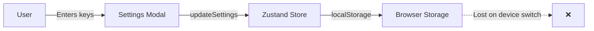
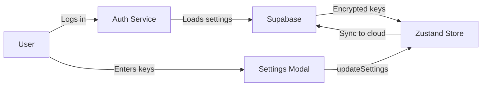

# 🚨 CRITICAL ISSUE: API Key Storage Architecture

**Issue Discovered**: 2025-10-27
**Severity**: HIGH - Affects multi-user/multi-device functionality
**Status**: NEEDS IMPLEMENTATION

---

## 🔍 Problem Summary

**Current Implementation**: API keys are stored **only in browser localStorage/IndexedDB**, NOT in Supabase per-user database.

**Expected Behavior**: Each logged-in user should provide their own OpenRouter and Gemini API keys, which should be:
1. Associated with their user account
2. Stored securely in Supabase
3. Synchronized across devices
4. Loaded automatically after login

---

## 📊 Current Architecture (FLAWED)

### What's Implemented

```typescript
// types.ts
export interface Settings {
    openRouterApiKey?: string;      // ✅ Defined
    openRouterEndpoint?: string;
    geminiApiKey?: string;           // ✅ Defined
    geminiEndpoint?: string;
    // ... other settings
}

// store/useStore.ts
interface BookCraftState {
    settings: Settings | null;       // ✅ In Zustand store
}

updateSettings: (newSettings) => {   // ✅ Update function exists
    set((state) => {
        state.settings = { ...state.settings, ...newSettings };
    });
}
```

### What's Missing

```typescript
// ❌ NO Supabase table for user_settings
// ❌ NO sync to cloud after updateSettings()
// ❌ NO loading settings from Supabase on login
// ❌ NO encryption for API keys in database
```

### Current Data Flow



**Problem**: Keys are **device-local only**. User logs in on different device → keys are GONE.

---

## 🎯 Expected Architecture (PER-USER KEYS)

### What Should Happen



### Required Changes

#### 1. Database Schema Addition

```sql
-- Create user_settings table in Supabase
CREATE TABLE IF NOT EXISTS user_settings (
    id UUID PRIMARY KEY DEFAULT gen_random_uuid(),
    user_id UUID NOT NULL REFERENCES auth.users(id) ON DELETE CASCADE,

    -- API Keys (ENCRYPTED)
    openrouter_api_key_encrypted TEXT,
    gemini_api_key_encrypted TEXT,

    -- API Endpoints
    openrouter_endpoint TEXT DEFAULT 'https://openrouter.ai/api/v1',
    gemini_endpoint TEXT DEFAULT 'https://generativelanguage.googleapis.com',

    -- UI Preferences
    theme TEXT DEFAULT 'light',
    editor_font_size INTEGER DEFAULT 16,
    auto_save BOOLEAN DEFAULT true,

    -- AI Preferences
    default_model TEXT DEFAULT 'nvidia/nemotron-nano-9b-v2:free',
    max_tokens INTEGER DEFAULT 4000,
    temperature DECIMAL DEFAULT 0.7,

    -- Metadata
    created_at TIMESTAMP WITH TIME ZONE DEFAULT now(),
    updated_at TIMESTAMP WITH TIME ZONE DEFAULT now(),

    -- One settings record per user
    UNIQUE(user_id)
);

-- Row Level Security
ALTER TABLE user_settings ENABLE ROW LEVEL SECURITY;

-- Users can only see their own settings
CREATE POLICY "Users can view own settings"
    ON user_settings FOR SELECT
    USING (auth.uid() = user_id);

-- Users can update their own settings
CREATE POLICY "Users can update own settings"
    ON user_settings FOR UPDATE
    USING (auth.uid() = user_id);

-- Users can insert their own settings
CREATE POLICY "Users can insert own settings"
    ON user_settings FOR INSERT
    WITH CHECK (auth.uid() = user_id);

-- Auto-update timestamp
CREATE OR REPLACE FUNCTION update_user_settings_timestamp()
RETURNS TRIGGER AS $$
BEGIN
    NEW.updated_at = now();
    RETURN NEW;
END;
$$ LANGUAGE plpgsql;

CREATE TRIGGER user_settings_updated_at
    BEFORE UPDATE ON user_settings
    FOR EACH ROW
    EXECUTE FUNCTION update_user_settings_timestamp();
```

#### 2. Service Layer for Encryption

```typescript
// services/settingsEncryption.ts (NEW FILE)
import CryptoJS from 'crypto-js';

// Use Supabase service_role key or user-specific encryption key
const ENCRYPTION_KEY = import.meta.env.VITE_SETTINGS_ENCRYPTION_KEY;

export const encryptApiKey = (apiKey: string): string => {
    if (!apiKey) return '';
    return CryptoJS.AES.encrypt(apiKey, ENCRYPTION_KEY).toString();
};

export const decryptApiKey = (encryptedKey: string): string => {
    if (!encryptedKey) return '';
    const bytes = CryptoJS.AES.decrypt(encryptedKey, ENCRYPTION_KEY);
    return bytes.toString(CryptoJS.enc.Utf8);
};
```

#### 3. Supabase Sync Functions

```typescript
// store/supabaseSync.ts (ADD TO EXISTING FILE)

/**
 * Load user settings from Supabase
 */
export async function loadSettingsFromSupabase(): Promise<Settings | null> {
    try {
        const user = await authService.getCurrentUser();
        if (!user) {
            logger.info('No authenticated user, skipping settings load');
            return null;
        }

        logger.info('Loading settings from Supabase', { userId: user.id });
        const supabase = getSupabaseClient();

        const { data: settings, error } = await supabase
            .from('user_settings')
            .select('*')
            .eq('user_id', user.id)
            .single();

        if (error) {
            if (error.code === 'PGRST116') {
                // No settings found - create default
                logger.info('No settings found, creating defaults');
                return await createDefaultSettings(user.id);
            }
            logger.error('Failed to load settings from Supabase', error);
            return null;
        }

        if (!settings) {
            return null;
        }

        // Decrypt API keys
        const { encryptApiKey, decryptApiKey } = await import('../services/settingsEncryption');

        return {
            openRouterApiKey: decryptApiKey(settings.openrouter_api_key_encrypted || ''),
            openRouterEndpoint: settings.openrouter_endpoint,
            geminiApiKey: decryptApiKey(settings.gemini_api_key_encrypted || ''),
            geminiEndpoint: settings.gemini_endpoint,
            theme: settings.theme,
            editorFontSize: settings.editor_font_size,
            autoSave: settings.auto_save,
            defaultModel: settings.default_model,
            maxTokens: settings.max_tokens,
            temperature: settings.temperature
        };
    } catch (error) {
        logger.error('Failed to load settings from Supabase', error);
        return null;
    }
}

/**
 * Save user settings to Supabase
 */
export async function saveSettingsToSupabase(settings: Settings): Promise<void> {
    try {
        const user = await authService.getCurrentUser();
        if (!user) {
            logger.warn('No authenticated user, cannot save settings');
            return;
        }

        const supabase = getSupabaseClient();
        logger.debug('Saving settings to Supabase', { userId: user.id });

        // Encrypt API keys
        const { encryptApiKey } = await import('../services/settingsEncryption');

        const settingsData = {
            user_id: user.id,
            openrouter_api_key_encrypted: settings.openRouterApiKey
                ? encryptApiKey(settings.openRouterApiKey)
                : null,
            gemini_api_key_encrypted: settings.geminiApiKey
                ? encryptApiKey(settings.geminiApiKey)
                : null,
            openrouter_endpoint: settings.openRouterEndpoint,
            gemini_endpoint: settings.geminiEndpoint,
            theme: settings.theme,
            editor_font_size: settings.editorFontSize,
            auto_save: settings.autoSave,
            default_model: settings.defaultModel,
            max_tokens: settings.maxTokens,
            temperature: settings.temperature
        };

        // Upsert settings
        const { error } = await supabase
            .from('user_settings')
            .upsert(settingsData, {
                onConflict: 'user_id'
            });

        if (error) {
            logger.error('Failed to save settings', error);
            throw error;
        }

        logger.info('Settings saved to Supabase successfully');
    } catch (error) {
        logger.error('Failed to save settings to Supabase', error);
        throw error;
    }
}

/**
 * Create default settings for new user
 */
async function createDefaultSettings(userId: string): Promise<Settings> {
    const defaultSettings: Settings = {
        openRouterEndpoint: 'https://openrouter.ai/api/v1',
        geminiEndpoint: 'https://generativelanguage.googleapis.com',
        theme: 'light',
        editorFontSize: 16,
        autoSave: true,
        defaultModel: 'nvidia/nemotron-nano-9b-v2:free',
        maxTokens: 4000,
        temperature: 0.7
    };

    try {
        await saveSettingsToSupabase(defaultSettings);
        return defaultSettings;
    } catch (error) {
        logger.error('Failed to create default settings', error);
        return defaultSettings;
    }
}
```

#### 4. Update Store Actions

```typescript
// store/useStore.ts (MODIFY EXISTING FUNCTIONS)

// In login action, after successful login:
login: async (email, password) => {
    try {
        const { signInWithEmail } = await import('../services/storage/supabase');
        const result = await signInWithEmail(email, password);

        if (result.success && result.user) {
            const user: User = {
                id: result.user.id,
                email: result.user.email || email,
                name: result.user.user_metadata?.name || email.split('@')[0],
                createdAt: new Date(result.user.created_at),
                lastLogin: new Date()
            };

            set((state) => {
                state.currentUser = user;
                state.isAuthenticated = true;
            });

            // ✅ ADD: Load user settings after login
            const { loadSettingsFromSupabase } = await import('./supabaseSync');
            const settings = await loadSettingsFromSupabase();
            if (settings) {
                set((state) => {
                    state.settings = settings;
                });
            }

            // Load user data from Supabase
            await loadFromSupabase();

            toast.success('Welcome Back', `Logged in as ${user.email}`);
            return { success: true };
        }
        // ... rest of login logic
    }
}

// Modify updateSettings to sync to cloud
updateSettings: (newSettings) => {
    set((state) => {
        state.settings = { ...state.settings, ...newSettings };
    });

    // ✅ ADD: Sync to Supabase after update
    import('./supabaseSync').then(({ saveSettingsToSupabase }) => {
        const currentSettings = useBookCraftStore.getState().settings;
        if (currentSettings) {
            saveSettingsToSupabase(currentSettings).catch(error => {
                logger.error('Failed to sync settings to cloud', error);
                toast.error('Sync Failed', 'Settings saved locally but not synced to cloud');
            });
        }
    });
},
```

---

## 🔐 Security Considerations

### API Key Encryption

**Why encrypt?**
- API keys are sensitive credentials
- Supabase database admins could see unencrypted keys
- Compliance requirements (PCI, GDPR, etc.)

**Encryption Strategy**:
1. **Client-side encryption** (best):
   - Encrypt before sending to Supabase
   - Use user-specific key derived from password
   - Keys never stored in plain text anywhere

2. **Server-side encryption** (alternative):
   - Supabase Edge Function encrypts on save
   - Decrypts on fetch
   - Uses service_role key

**Recommended**: Client-side with `crypto-js` library (already in package.json for jsPDF)

---

## 📦 Required Dependencies

```bash
# Already installed (verify):
npm list crypto-js

# If not installed:
npm install crypto-js
npm install --save-dev @types/crypto-js
```

---

## ✅ Implementation Checklist

### Phase 1: Database Setup (30 minutes)
- [ ] Create `user_settings` table in Supabase
- [ ] Add Row Level Security policies
- [ ] Test table creation and policies

### Phase 2: Service Layer (1-2 hours)
- [ ] Create `services/settingsEncryption.ts`
- [ ] Add encryption/decryption functions
- [ ] Add environment variable for encryption key
- [ ] Test encryption/decryption

### Phase 3: Sync Functions (2-3 hours)
- [ ] Add `loadSettingsFromSupabase()` to `store/supabaseSync.ts`
- [ ] Add `saveSettingsToSupabase()` to `store/supabaseSync.ts`
- [ ] Add `createDefaultSettings()` helper
- [ ] Test settings load/save

### Phase 4: Store Integration (1-2 hours)
- [ ] Modify `login` action to load settings
- [ ] Modify `updateSettings` action to sync to cloud
- [ ] Add error handling for sync failures
- [ ] Test full login → load → update → sync flow

### Phase 5: Testing (2-3 hours)
- [ ] Test new user registration → default settings
- [ ] Test login → settings loaded
- [ ] Test update settings → synced to cloud
- [ ] Test login from different device → keys available
- [ ] Test network failure → graceful degradation
- [ ] Test encryption → keys stored encrypted

### Phase 6: Migration (1-2 hours)
- [ ] Create migration for existing users
- [ ] Move localStorage settings to Supabase
- [ ] Test with existing user accounts

---

## 📈 Estimated Effort

| Phase | Time | Difficulty |
|-------|------|------------|
| Database Setup | 30 min | Easy |
| Service Layer | 1-2 hours | Medium |
| Sync Functions | 2-3 hours | Medium |
| Store Integration | 1-2 hours | Easy |
| Testing | 2-3 hours | Medium |
| Migration | 1-2 hours | Medium |
| **TOTAL** | **8-13 hours** | **Medium** |

---

## 🚦 Current Status

### What Works
- ✅ Users can log in/register
- ✅ Settings modal allows API key input
- ✅ API keys stored in Zustand store
- ✅ API keys used by AI services
- ✅ Projects/chapters sync to Supabase per-user

### What's Broken
- ❌ API keys NOT synced to Supabase
- ❌ API keys lost on device switch
- ❌ API keys lost on localStorage clear
- ❌ No encryption of API keys
- ❌ Settings not loaded after login

---

## 🎯 Priority

**PRIORITY**: **HIGH**

This is a **fundamental architectural issue** for a multi-user application. Without per-user settings sync:
- Users cannot use the app on multiple devices
- API keys are lost easily
- No true multi-tenancy
- Security concerns (unencrypted keys)

**Recommended**: Implement before public beta or production launch.

---

## 📝 Additional Notes

### Alternative Approaches

#### Option 1: Client-side only (current, problematic)
- ❌ Keys lost on device switch
- ❌ No sync across devices
- ✅ Simple implementation
- ✅ No server-side storage

#### Option 2: Encrypted in Supabase (recommended)
- ✅ Synced across devices
- ✅ Persistent storage
- ✅ Encrypted for security
- ⚠️ Requires encryption key management

#### Option 3: Supabase Vault (enterprise)
- ✅ Most secure
- ✅ Built-in encryption
- ✅ Audit logging
- ❌ Requires Supabase Pro plan
- ❌ More complex setup

**Recommended**: Option 2 (encrypted in user_settings table)

---

## 🔗 Related Files

- `store/useStore.ts` - Settings state and actions
- `store/supabaseSync.ts` - Supabase sync functions
- `components/SettingsModal.tsx` - UI for entering API keys
- `services/ai.ts` - Consumes API keys for AI operations
- `types.ts` - Settings interface definition
- `supabase-schema.sql` - Database schema (needs update)

---

## 📞 Questions?

**Implementation Priority**: HIGH
**Blocker for**: Multi-device support, production launch
**Estimated LOE**: 1-2 days for full implementation and testing

---

*Document created: 2025-10-27*
*Issue discovered during TODO verification*
*Status: NEEDS IMPLEMENTATION*
